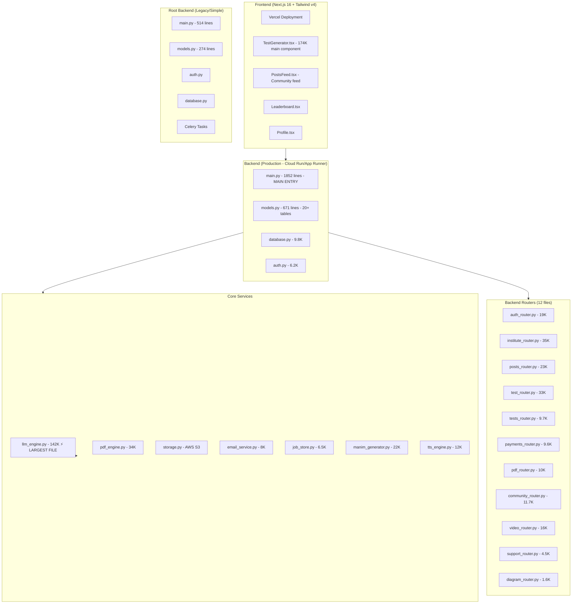

# INFINITEST — Codebase Brief

> **Product**: AI-powered test paper generator for JEE, NEET, GATE, and CBSE Board exams  
> **Brand**: Previously "Mentors Mantra", now rebranded to **INFINITEST** (`infinitest.tech`)

---

## Architecture Overview

---

## Tech Stack

| Layer | Technology |
|-------|-----------|
| **Frontend** | Next.js 16, React 19, Tailwind CSS v4, TypeScript |
| **Backend** | FastAPI (Python), SQLAlchemy ORM |
| **Database** | PostgreSQL (production), SQLite (local dev) |
| **AI/LLM** | LiteLLM (Gemini, OpenAI, Claude) — primary model: `gemini-2.5-flash` |
| **PDF** | pdflatex + Jinja2 LaTeX templates (with ReportLab fallback) |
| **Storage** | AWS S3 (`infinitest-pdfs` bucket, `ap-south-1`) |
| **Payments** | Cashfree (Indian payment gateway) |
| **Auth** | JWT (access + refresh tokens), bcrypt, Google OAuth |
| **Email** | Custom email service (verification, password reset) |
| **Video** | Manim + TTS engine for educational video generation |
| **Diagrams** | Custom diagram engine (TikZ + SVG→PNG) |
| **Deployment** | Google Cloud Run / AWS App Runner (backend), Vercel (frontend) |
| **Background Jobs** | Celery + Redis (legacy), FastAPI BackgroundTasks + SSE (current) |

---

## Database Models (20+ tables)

### Core User System
- **User** — email, password, name, username, phone, class_grade, plan (free/earth/universe), premium status, bonus limits
- **RefreshToken** — session management (7-day expiry)
- **VerificationToken** — email verification (24h expiry)
- **PasswordResetToken** — password reset (1h expiry)

### PDF Generation
- **PDFGeneration** — tracks generations for rate limiting (per-month billing cycle)
- **TopicSubjectCache** — caches LLM subject detection results
- **SharedPDF** — community-shared PDFs with likes, downloads, views
- **PDFLike** — user ↔ PDF like relationship

### Test Portal (NTA CBT-style)
- **Test** — master test with questions JSON, visibility (PRIVATE/CLASSROOM/COMMUNITY), share codes
- **TestAttempt** — user test sessions with NTA 5-state tracking
- **QuestionResponse** — individual question responses with time tracking
- **TestLeaderboard** — per-test user rankings

### Institute System
- **InstituteUser** — separate auth for institutes
- **InstituteRefreshToken** — institute sessions
- **InstituteGeneration** — institute PDF tracking

### Social & Gamification
- **UserBadge** — achievement system (first_post, prolific, popular, viral)
- **PromoCode** / **PromoCodeUsage** — promotional codes for bonus generations

### Payments & Subscriptions
- **PaymentOrder** — Cashfree order tracking (PENDING/PAID/FAILED)
- **UserSubscription** — active plan (free/earth/universe), 30-day billing cycles

### Analytics & Logging
- **APIUsageLog** — per-LLM-call token tracking
- **TotalAPIUsage** — per-generation aggregated token stats
- **SystemErrorLog** — frontend/backend error logging
- **UserQuestionHistory** — fresh question deduplication (MD5 hashing)
- **SupportTicket** — user support with attachments

---

## Subscription Plans

| Plan | Price | PDF/month | Tests | Institute PDFs |
|------|-------|-----------|-------|----------------|
| **Free** | ₹0 | 5 | 4 | 0 |
| **Earth** | ₹19/mo | 10 | Unlimited | 1/month |
| **Universe** | ₹99/mo | Unlimited | Unlimited | 4/month |

---

## Key Features & Endpoints

### PDF Generation (`/api/generate`, `/api/generate-verified`, `/api/generate-sse/start`)
1. **Sync generation** — immediate response with base64 PDF
2. **Verified generation** — numerical answers are re-verified by LLM
3. **SSE streaming** — background job with real-time progress via Server-Sent Events
4. **Top-up logic** — if LLM under-generates, automatically requests more questions (up to 3 retries)
5. **Fresh questions** — tracks user question history to avoid repetition
6. **Institute PDFs** — branded multi-subject papers with custom headers

### Exam Types Supported
- **JEE Mains** — MCQ + Numerical (80/20 split)
- **JEE Advanced** — MCQ + Numerical + Matrix Match + Paragraph/Comprehension
- **NEET** — MCQ only
- **GATE** — MCQ + MSQ + NAT + General Aptitude
- **CBSE Boards** — MCQ + VSA + SA + LA + Case-based
- **Olympiad**

### Community Features
- Post sharing with visibility (public/private/unlisted)
- Like/unlike, download tracking, view counts
- Leaderboard (most likes, most posts)
- Username system
- Badge system

### Test Portal (CBT)
- Create & take tests online (NTA-style interface)
- 5-state question tracking (Not Visited, Not Answered, Answered, Marked for Review, Answered+Marked)
- Timer, auto-submit on expiry
- Per-test leaderboard
- Share via codes

### Video Generation
- Manim-based educational video rendering
- TTS (Text-to-Speech) for narration
- S3 storage for rendered videos

---

## Frontend Structure

- **`app/page.tsx`** — Home page: 3-column layout (sidebar, community feed, test generator)
- **`components/TestGenerator.tsx`** (174K!) — The main test generation form — handles every exam type, SSE progress, question preview
- **`components/PostsFeed.tsx`** (37K) — Community feed with infinite scroll
- **`lib/auth-context.tsx`** — Auth provider with auto-refresh, authFetch wrapper
- **`lib/generation-context.tsx`** — Generation state management
- **`lib/config.ts`** — API URL resolution (defaults to AWS App Runner)
- **`lib/ncert-chapters.ts`** / **`lib/gate-chapters.ts`** — Chapter/topic data for selectors
- **`hooks/useExamSecurity.ts`** — Anti-cheating measures for test portal

---

## Deployment

| Component | Platform | URL |
|-----------|----------|-----|
| Frontend | Vercel | `infinitest.tech` |
| Backend (primary) | AWS App Runner | `q3vgjfnybq.ap-south-1.awsapprunner.com` |
| Backend (legacy) | GCP Cloud Run | `mentors-mantra-api-87253755436.us-central1.run.app` |
| Storage | AWS S3 | `infinitest-pdfs.s3.ap-south-1.amazonaws.com` |

---

## Root vs Backend Directory

There are **two backends** in this repo:
1. **Root level** (`main.py`, `models.py`, etc.) — **legacy/simplified** version with basic PDF generation, 3 routers
2. **`backend/` directory** — **production** version with 1852-line main.py, 12 routers, 671-line models, all features

The **production backend** (`backend/`) is the active one deployed to AWS App Runner / GCP Cloud Run.

---

## Notable Code Patterns

1. **LLM Engine** (`llm_engine.py` — 142K) is by far the largest file, handling all LLM interactions, prompt engineering, question generation, verification, and subject detection
2. **PDF Engine** uses Jinja2 templates with custom LaTeX-safe delimiters (`\VAR{}`, `\BLOCK{}`) and extensive Unicode→LaTeX character mapping
3. **Rate limiting** is per-month based on subscription plan, with promo code bonuses and monthly resets
4. **SSE (Server-Sent Events)** is the primary generation flow — starts a background task, streams progress + partial questions to frontend
5. **Dual auth system** — regular users + institute users have separate models and tokens
6. **Database migrations** are done via manual `ALTER TABLE` statements in `init_db()` (no Alembic)
